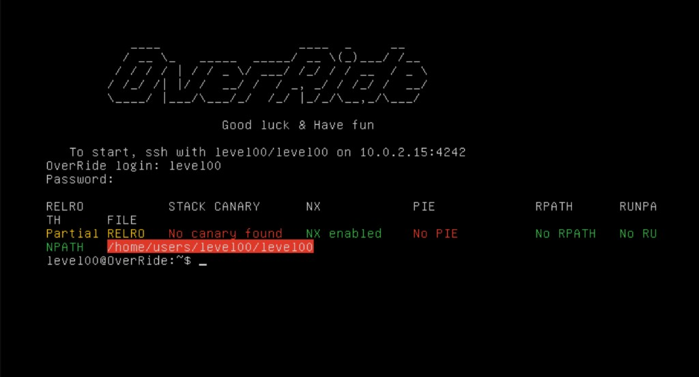

# 42-binary-security

## 1. Intro

This repository groups several **42 school** curriculum projects in **binary analysis**, **reverse engineering**, and **low-level Linux security**. The material is **educational and lab-oriented**: structured writeups, recovered context, and small helpers that show how each challenge was approached in a controlled environment—not a claim of professional offensive-security experience.



*Example challenge environment and binary protection context from the OverRide track.*

## 2. What this repository covers

Across the three projects, the common threads are:

- **Linux privilege escalation and trust boundaries** (permissions, SUID, cron, services)
- **Binary analysis and reverse engineering** (static reading, disassembly/decompiler use, reasoning about control flow)
- **Memory-corruption exploitation** on the stack and heap, including **format-string** abuse where it appears in the levels
- **Shellcode and payload shaping** under layout and syscall constraints (including environment placement and NOP sleds where relevant)
- **Debugger-assisted analysis** (`gdb` and related workflows)
- **Low-level security reasoning**: tracing how a program checks input, where assumptions break, and how mitigations or quirks change the exploit path

## 3. Projects

| Project | Focus | What it demonstrates |
| --- | --- | --- |
| [snowcrash](./snowcrash/) | Privilege escalation, Linux trust boundaries, SUID/cron/service paths, debugger-assisted bypasses | Structured level writeups: binary/script recon, local misconfiguration and injection patterns, **gdb**-oriented bypasses |
| [rainfall](./rainfall/) | Binary exploitation: stack / heap / format-string, shellcode, payload construction | Documented progression (levels + bonuses): memory corruption, format strings (incl. GOT), shellcode delivery, heap/C++ cases, integer/logic pitfalls |
| [override](./override/) | Advanced binary exploitation: ret2libc, format-string leaks and writes, ptrace constraints, integer tricks | Per-level analysis: static/dynamic work, shellcode under syscall monitoring, ret2libc and format abuse, application-level tricks (x86 → x86-64) |

## 4. Repository structure

```
42-binary-security/
├── snowcrash/    # privilege escalation track (levels + solution.md / artifacts)
├── rainfall/     # binary exploitation track (levels + resources/, tools/)
└── override/     # binary exploitation track (levels + solution.md / artifacts)
```

## 5. Portfolio note

This is **educational, lab, and CTF-style** work from the 42 curriculum. **Challenge secrets and progression artifacts** (flags, passwords, and similar tokens) are **removed or redacted** in this public version so the repo stays a readable portfolio sample without spoiling or leaking challenge material.
